# 🔗 Wavelet Coherence entre Parâmetros Ionosféricos — Dados OMNI

Este repositório contém um script MATLAB desenvolvido para calcular e visualizar a **Coerência Wavelet (Wavelet Coherence – WCOH)** entre pares de parâmetros físicos do banco de dados OMNI (com resolução de 5 minutos).  
A análise permite identificar relações espectro-temporais entre grandezas relacionadas ao vento solar e ao campo geomagnético.

## 🛠 Tecnologias Utilizadas

- **MATLAB**
- Arquivo tabulado `dados_Omni_Tratados.txt` contendo dados OMNI pré-processados


---

## 💡 Objetivo

Avaliar a coerência entre diferentes parâmetros solares e geomagnéticos ao longo do tempo, identificando:

- periodicidades comuns  
- correlações espectrais variáveis  
- possíveis relações dinâmicas entre parâmetros do vento solar e índices geomagnéticos  

Os pares analisados incluem, por exemplo:

- Bz × Velocidade (Vsw)  
- Densidade × Ey  
- AE × SYM/H  
- entre outras combinações possíveis

---

## 🚀 Funcionalidades

- Leitura automática dos dados OMNI em formato tabulado  
- Conversão da data/hora para `datetime`  
- Interpolação dos dados para uma grade temporal regular de 5 minutos  
- Tratamento de NaNs e extensão espelhada para reduzir bordas na análise  
- Aplicação da **Coerência Wavelet (WCOH)** com `cwtfilterbank` customizado  
- Geração de gráficos espectro-temporais da coerência entre todos os pares possíveis  
- Eixo Y em períodos (dias), com escala log2  
- Eixo X formatado com datas a cada 2 dias  

---

## 📦 Como Executar o Projeto

### **1️⃣ Preparar o arquivo de dados**

Antes de rodar o script, verifique se o arquivo **dados_Omni_Tratados.txt** está na mesma pasta e contém as colunas:

1. Dia (DD)  
2. Mês (MM)  
3. Ano (YYYY)  
4. Hora:Min  
5. Bz (nT, GSM)  
6. Velocidade Vsw (km/s)  
7. Densidade de prótons (n/cc)  
8. Campo elétrico Ey (mV/m)  
9. Índice AE (nT)  
10. Índice SYM/H (nT)

### **2️⃣ Rodar o script**

No MATLAB:

```matlab
run wavelet_coherence_omni.m
```
O script irá gerar gráficos para todas as combinações possíveis entre as 6 variáveis OMNI (15 gráficos no total).

## 🔧 Detalhes Técnicos da Implementação

- Frequência de amostragem utilizada: **1 ponto a cada 300 s (5 min)**  
- Intervalo temporal analisado: **01/08/2017 a 01/09/2017**  
- Interpolação linear para alinhar os dados à grade fixa  
- Extensão espelhada (*mirror padding*) para reduzir distorções na análise wavelet  
- Uso de:

```matlab
wcoherence(sig1_ext, sig2_ext, seconds(dt), 'FilterBank', fb)
```

- Coerência recortada apenas na região correspondente aos dados originais  
- Normalização dos períodos e uso de `log2(period)` para o eixo Y  
- Máscara de NaN aplicada à coerência para garantir consistência visual  

## 📂 Estrutura do Repositório
```
wavelet_coherence_omni/
├── dados_Omni_Tratados.txt       # Arquivo de entrada com dados OMNI
├── wavelet_coherence_omni.m      # Script MATLAB principal
└── README.md                     # Documentação do projeto
```
## 📊 Resultados: Todas as 15 Combinações de Coerência Wavelet

A seguir são apresentadas as 15 figuras geradas pelo script, correspondentes a todas as combinações possíveis entre:

- **Bz**
- **Vsw**
- **Density**
- **Ey**
- **AE**
- **SYM/H**

---

### 🔹 1. Bz × Vsw
<div align="center">
  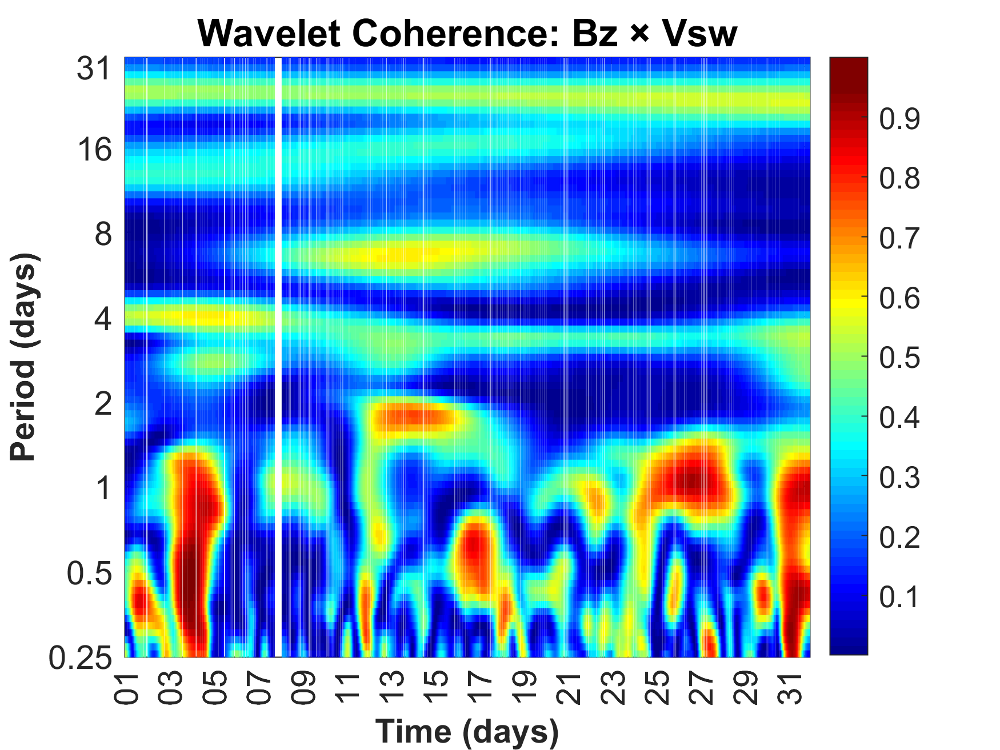
</div>

### 🔹 2. Bz × Density
<div align="center">
  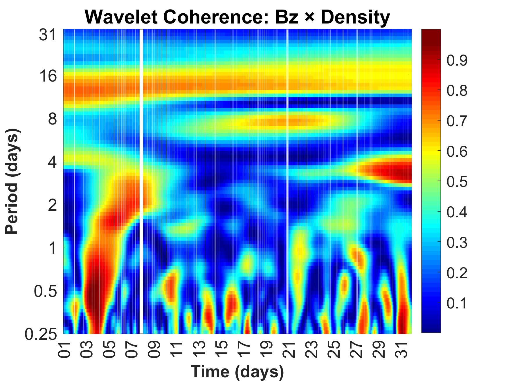
</div>

### 🔹 3. Bz × Ey
<div align="center">
  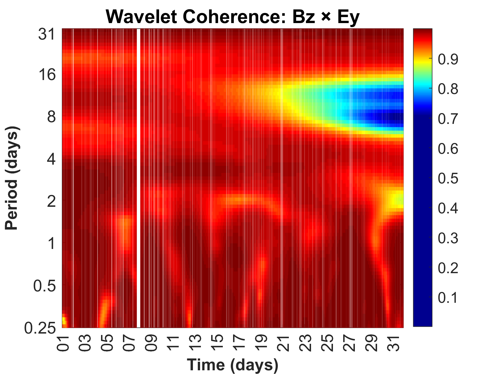
</div>

### 🔹 4. Bz × AE
<div align="center">
  
</div>

### 🔹 5. Bz × SYM/H
<div align="center">
  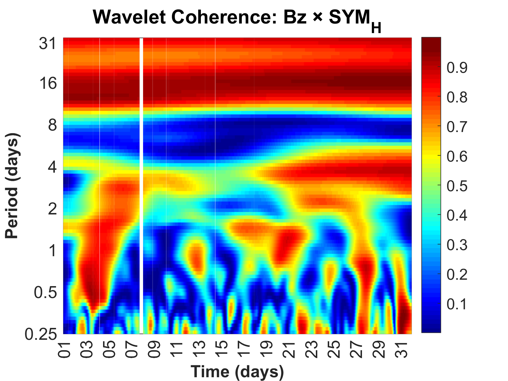
</div>

---

### 🔹 6. Vsw × Density
<div align="center">
  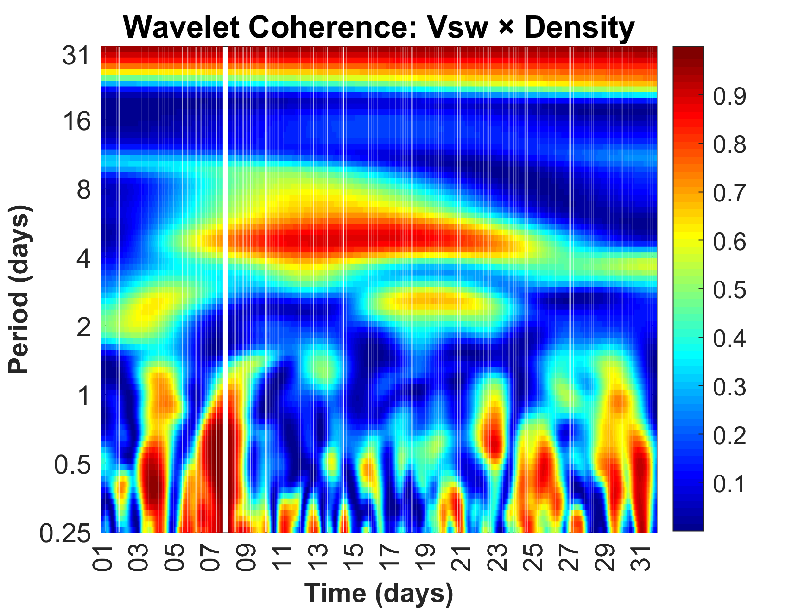
</div>

### 🔹 7. Vsw × Ey
<div align="center">
  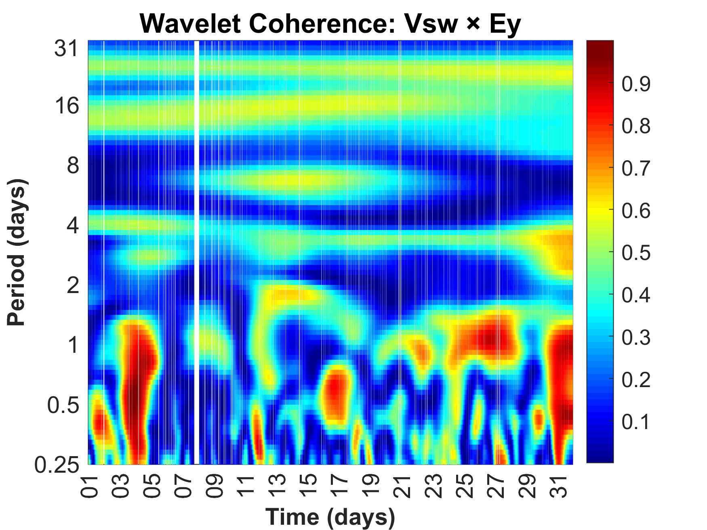
</div>

### 🔹 8. Vsw × AE
<div align="center">
  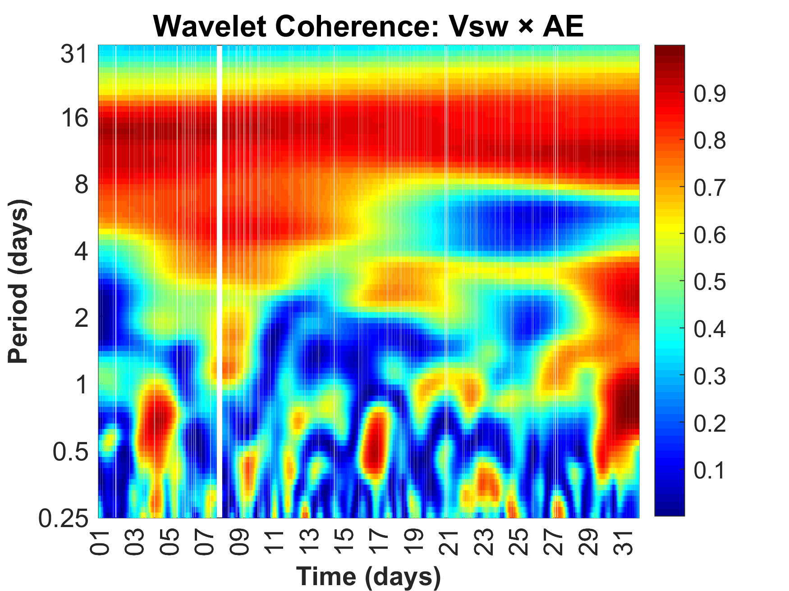
</div>

### 🔹 9. Vsw × SYM/H
<div align="center">
  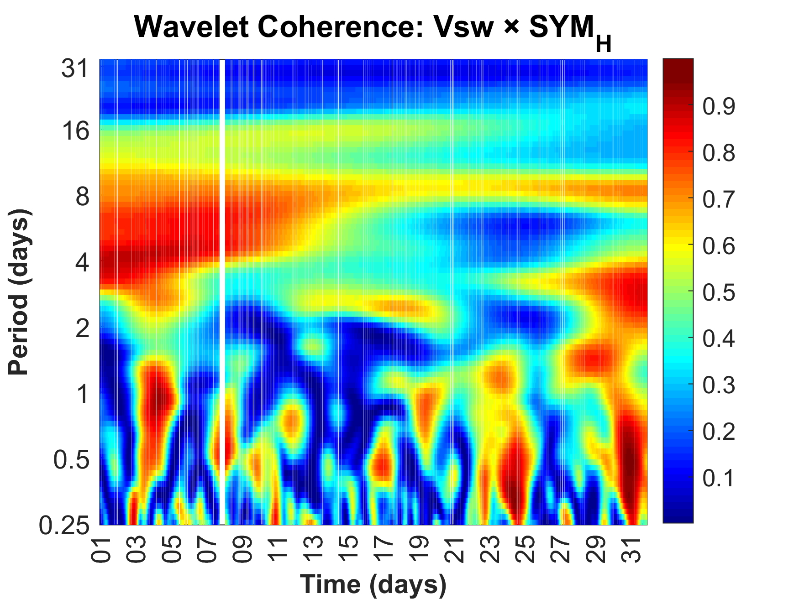
</div>

---

### 🔹 10. Density × Ey
<div align="center">
  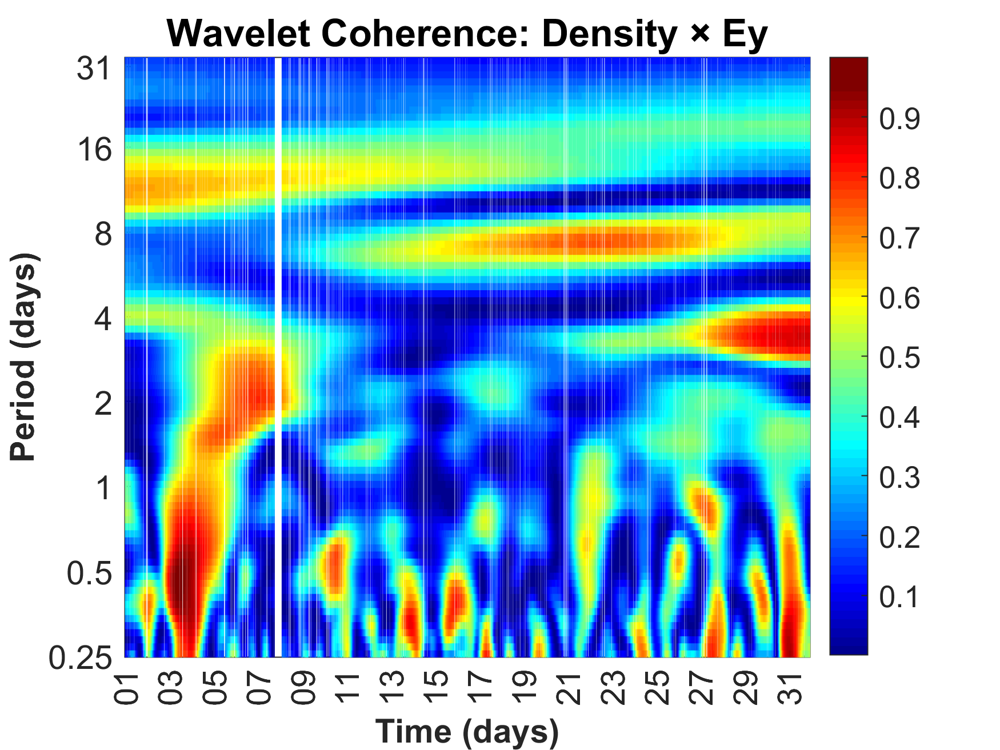
</div>

### 🔹 11. Density × AE
<div align="center">
  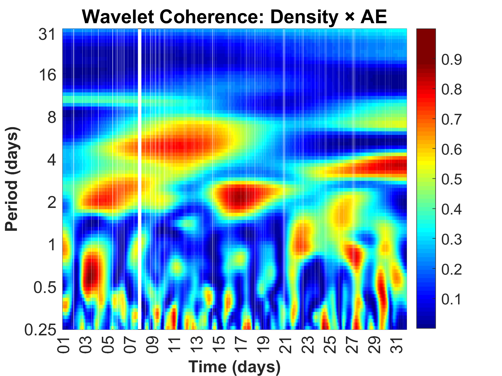
</div>

### 🔹 12. Density × SYM/H
<div align="center">
  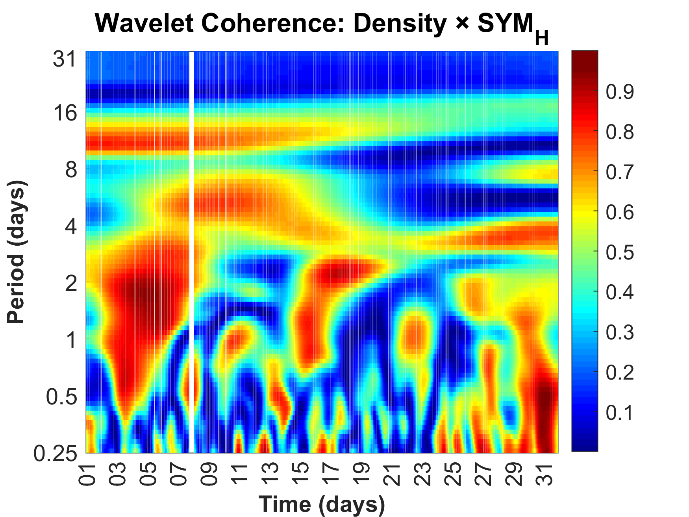
</div>

---

### 🔹 13. Ey × AE
<div align="center">
  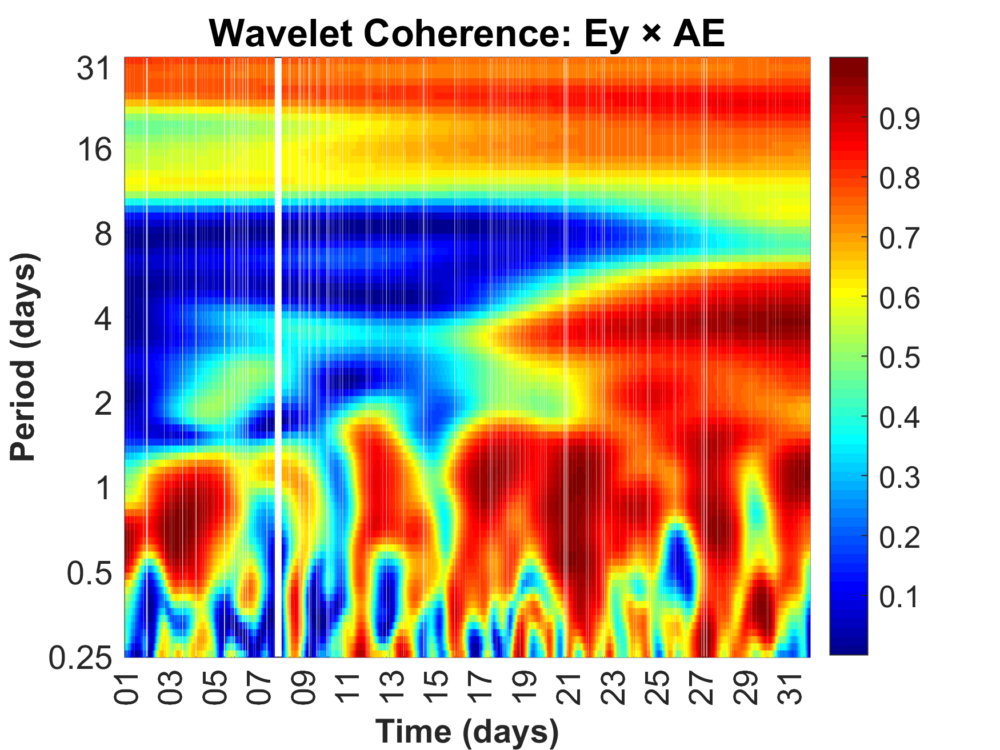
</div>

### 🔹 14. Ey × SYM/H
<div align="center">
  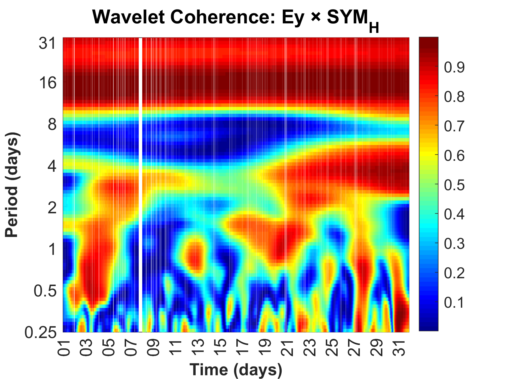
</div>

---

### 🔹 15. AE × SYM/H
<div align="center">
  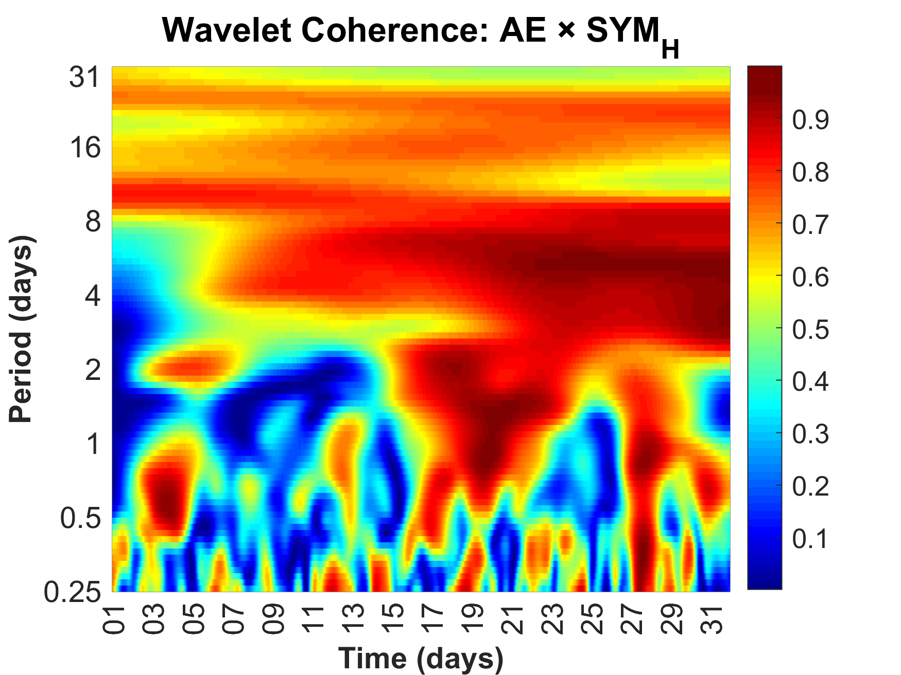
</div>

## 🤝 Agradecimentos

Este projeto auxilia pesquisadores em Física Espacial e Geomagnetismo na análise de relações dinâmicas entre parâmetros solares e magnetosféricos, oferecendo uma ferramenta robusta de análise espectral temporal cruzada.

## 📜 Licença

Este projeto está licenciado sob a MIT License. Consulte o arquivo LICENSE para mais detalhes.
